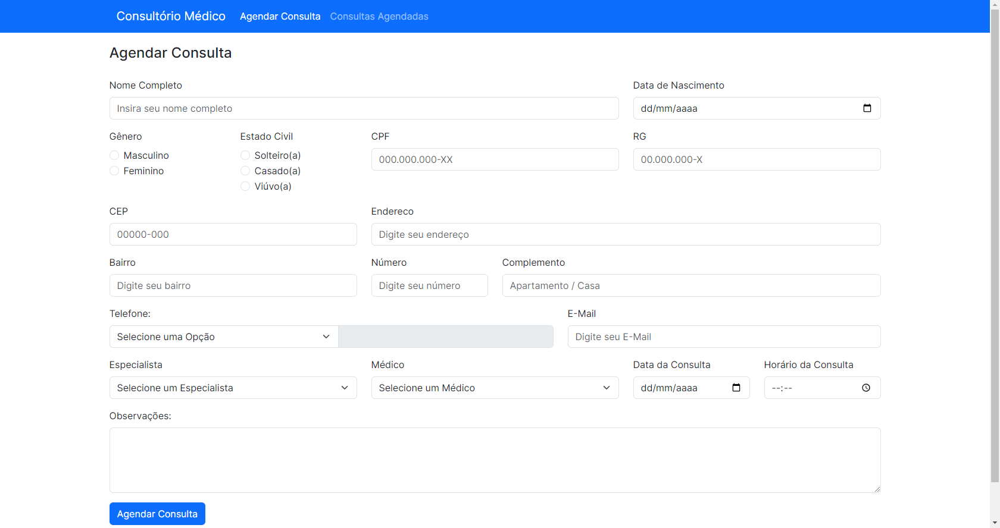

# Consultório Médico
Sistema feito em HTML, CSS, Bootstrap v5.3, Javascript e PHP
## Funcionamento Web
- Acesse o link: https://ferreiraluizga.github.io/consultorioMedico/
## Funcionamento Local
- Baixe o repositório ou clone em sua máquina
- Utilize o XAMPP (inicialize o servidor Apache)
- Na URL do seu navegador digite: localhost/_nome_da_pasta_do_repositório
## Sobre o Sistema
- Formulário de agendamento de consulta e visualização de consultas agendadas
- Validação de campos em JS
- Uso do método POST (PHP) para recolher informações digitadas pelo usuário
- Estilização com Bootstrap v5.3
- Desenvolvido no Visual Studio Code
## Prévia do Sistema

